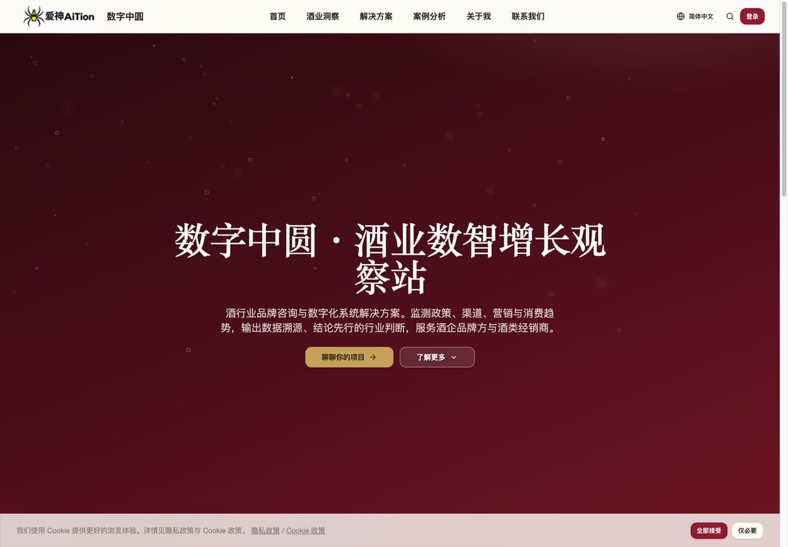
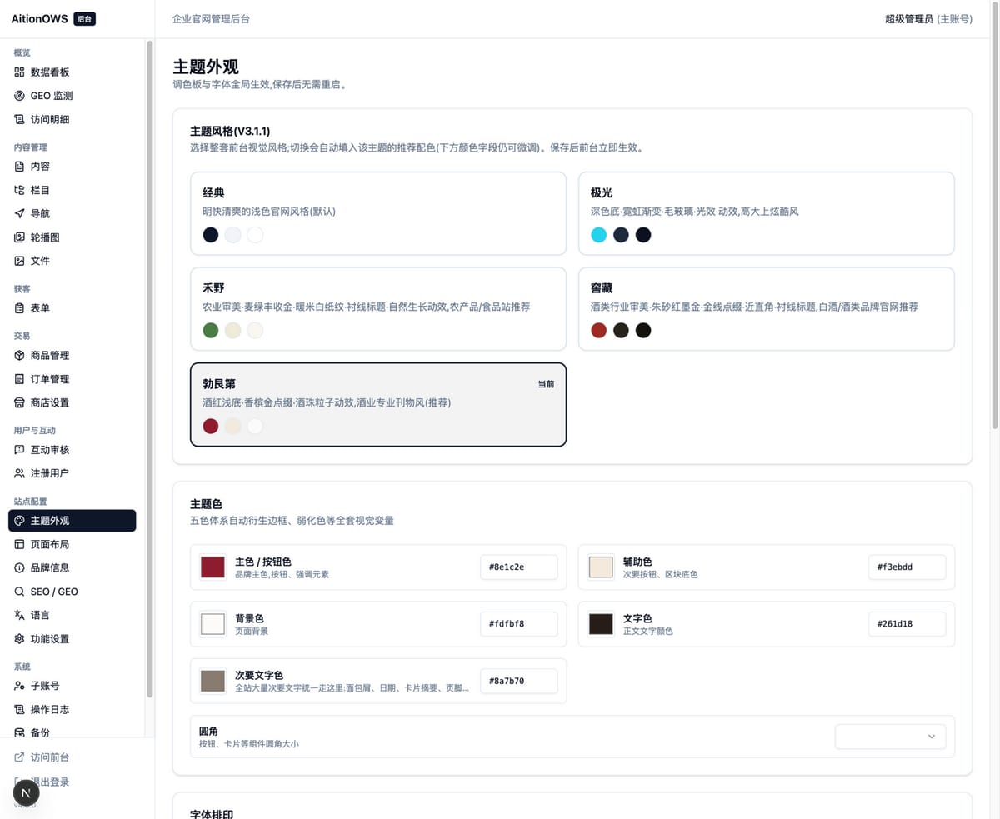
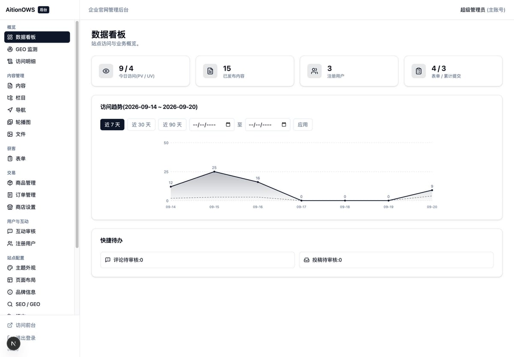

# AitionOWS · 自包含企业官网 / 自媒体内容站系统

**一条命令部署、后台全可视化、对 AI 检索友好的中文官网系统。**
Next.js 15 + SQLite 单容器自包含:不需要云数据库、对象存储、缓存服务,数据全在你自己服务器上。

> **在线体验(生产实例,正在持续运营)**
> 👉 **https://www.aition.xin** — 这是一个酒行业咨询自媒体的真实站点,用的就是这个系统。
> 后台需要账号才能进;想体验后台请直接联系作者(见文末)开通演示账号。

当前版本 **v4.8.0** · 350 项自动化测试 · Prisma 迁移文件化 · Docker 单容器

### 界面一览

| 前台首页(生产实例) | 文章详情(导语块 + 作者 + 阅读数) |
|---|---|
|  |  |
| **5 套主题包,后台一键切换** | **后台数据看板(PV/UV 趋势 + 业务总量)** |
|  |  |

---

## 一、为什么是它(9 个差异化卖点)

| # | 卖点 | 具体是什么 | 为什么重要 |
|---|---|---|---|
| 1 | **一条命令上线,零外部依赖** | 前台后台 + 数据库 + 文件存储打包在一个容器里;数据落在挂载的两个卷(`data/`、`uploads/`),重建容器不丢 | 不用买云数据库/OSS/CDN,也不担心数据被平台锁住;小站一台 1 核 2G 服务器就够跑 |
| 2 | **后台改完即时生效** | 主题、品牌、栏目、文案、开关全部入库;保存后进程内缓存失效 + `revalidateTag`,**不重新构建、不重启** | 非技术同事也能自己改站,不用每次找你发版本 |
| 3 | **对 AI 检索友好(GEO)** | 自动生成 `llms.txt` 站点自述、`Organization`/`Article` 结构化数据、hreflang、动态 `sitemap.xml`/`robots.txt`;正文走服务端渲染 | 2026 年的获客入口已经包含"AI 里被问到时的答案来源",纯 CSR 站与纯静态模板先天吃亏 |
| 4 | **AI 抓取与引荐来源可观测** | 后台「GEO 监测」区分 **AI 引擎 / 传统搜索 / 疑似抓取 / 未识别来源** 四个分区,分别统计抓取与引荐 | 别的系统只给你 PV/UV;这里能回答"AI 到底来没来、从哪来、抓了什么" |
| 5 | **多语言从路由到内容** | `/zh-CN`、`/en` 独立路由与 SEO;内容按语言分别编辑(标题/摘要/正文/TDK 都可不同),语言本身可后台增删 | 出海站不用二次开发;单站就能同时挂中英文 |
| 6 | **5 套主题包 + 4 套首页布局** | 经典/极光/禾野/窖藏/勃艮第(酒红浅底)一键切换;首页 grid / hero-list / split / spotlight,栏目页 list / magazine;另有通透度、毛玻璃、页头透明开关 | 换风格不用改代码,同一套系统能交付给审美完全不同的客户 |
| 7 | **内容 → 交易 → 互动全链路** | 栏目树/导航/富文本/定时发布;商品·价格·订单·仅退款·下单总开关;投稿审核、评论两层回复、点赞转发收藏、敏感词库 | 从"展示官网"到"能收单"不用再拼第二套系统 |
| 8 | **内容置顶 + 上传即压** | 后台一键置顶(可选到期时间,到点自动落下);图片上传自动压缩为 WebP(显示)+ JPG(社交分享)双版本 | 运营位是官网刚需;而"4MB 大图拖慢打开"是国内站最常见的性能事故 |
| 9 | **可选「拟真互动数据」(默认关闭)** | 阅读/点赞/转发/收藏可按自然增长曲线展示,并支持对真实阅读做系数放大(分 5 天延迟释放,不是瞬间跳变);**只影响前台展示,真实计数单独保留,后台并排可核对** | 新站冷启动时"0 阅读"会劝退访客;这件事与其偷偷刷,不如做成一个诚实、可关、可调的开关 |

补充三条工程侧的:

| # | 卖点 | 具体是什么 |
|---|---|---|
| 10 | **AI 工具链打通** | 内置 MCP Server(`push_article` / `list_articles` / `get_article` / `list_categories` / `upload_image` 五个工具):在 WorkBuddy、Trae 等 MCP 客户端里写完稿,一句话推到官网生成**草稿**,人工过目后再发布 |
| 11 | **质量与可维护性** | 350 项自动化测试(含 SSR 端到端)、`docs/` 下设需求与验收门禁、Prisma 迁移文件化、服务层与数据库严格隔离、关键逻辑全中文注释 —— 便于长期迭代与 AI 协助维护 |
| 12 | **合规内置** | 用户协议/隐私政策/Cookie 政策(中英双语,按系统真实行为撰写)、同意条幅、备案信息与运营主体展示、无第三方统计(自建 PV/UV)、数据存境内 |

---

## 二、功能地图

| 域 | 能力 |
|---|---|
| 内容 | 多级栏目树、导航(支持分组/外链)、Tiptap 富文本(图文/视频/颜色/字号)、草稿·发布·下架·定时发布、内容置顶(可到期)、多语言内容与单页 TDK、关键词与摘要、作者署名 |
| 媒体 | 素材库 + 二级文件夹、图片自动压缩(WebP 显示 / JPG 分享伴生)、尺寸登记、alt 语义、上传类型白名单 |
| 获客 | 表单可视化构建(7 种字段)、服务端复验、防重复 + 限频、数据筛选与 CSV 导出、表单可挂载到页面与内容 |
| 互动 | 评论(先审后发、**两层回复**、作者徽标)、点赞/转发/收藏(防刷)、游客评论开关、敏感词库、投稿审核 |
| 交易 | 商品管理(列表/卡片视图)、价格与币种、SPU、图集与规格参数、订单与**仅退款**、在线下单总开关 |
| 用户 | 邮箱注册登录、微信 PC 扫码登录(需自配开放平台 AppID)、强制登录开关、用户禁用、个人中心(我的收藏/订单/资料) |
| 站点配置 | 主题包与调色板、布局预设与首页楼层、品牌信息(LOGO/备案/联系方式/社交)、SEO 与 GEO、多语言文案覆盖、错误页文案、维护模式 |
| 运营与运维 | 数据看板(PV/UV 趋势、业务总量)、**GEO 监测**、访问明细、站内搜索(高亮 + 热门词)、子账号与权限组、操作日志、一键备份(SQLite 热备 + 文件)、安全设置 |
| AI / 集成 | `llms.txt`、结构化数据、**MCP Server**(AI 客户端直接投稿)、Bearer 令牌程序化发布 |

---

## 三、技术栈

| 层 | 选型 |
|---|---|
| 框架 | Next.js 15(App Router,SSR)+ React 19 |
| 样式 | Tailwind CSS + shadcn/ui(CSS 变量驱动主题) |
| 多语言 | next-intl(路由 + 服务端文案,可被后台数据库覆盖) |
| 数据 | SQLite(WAL)+ Prisma 6(迁移文件化,启动自动 `migrate deploy`) |
| 认证 | 自研轻量 JWT(httpOnly cookie;管理员 / 前台用户双体系隔离) |
| 富文本 | Tiptap(服务端渲染前二次消毒,防存储型 XSS) |
| 图片 | sharp(WebP 显示版 + JPG 分享版,尺寸自动登记) |
| 存储 | 服务器本地 `uploads/`(硬性设计:不接任何云存储) |
| 部署 | Docker 单容器 + Caddy 反代(compose 一键起) |
| 测试 | Vitest(350 项,含真实 SSR 集成测试) |

**运行要求**:Node.js ≥ 20;生产建议 1 核 2G 起,磁盘按内容量估算(图片已自动压缩)。

---

## 四、快速开始

### 本地开发

```bash
npm install
cp .env.example .env          # 填一个 AUTH_SECRET:openssl rand -base64 48
npx prisma migrate deploy     # 应用迁移
npx prisma db seed            # 初始化管理员/语言/配置(幂等,不覆盖你的配置)
npm run dev
```

- 前台 <http://localhost:3000/zh-CN> · 后台 <http://localhost:3000/zh-CN/admin>
- 默认管理员 `admin` / `admin888`(**首次登录强制改密**)

### 生产部署(一条命令)

```bash
docker compose -f docker/docker-compose.yml up -d --build
```

容器启动时自动:建运行时目录 → 应用数据库迁移 → 幂等种子 → 起服务。
反向代理与 HTTPS 见 [docs/部署说明.md](docs/部署说明.md)。

### 文档索引

| 文档 | 内容 |
|---|---|
| [docs/部署说明.md](docs/部署说明.md) | 生产部署、备份与回滚 |
| [docs/后台使用手册.md](docs/后台使用手册.md) | 运营同事的日常操作 |
| [docs/架构设计文档.md](docs/架构设计文档.md) | 分层、数据模型、扩展方式 |
| [docs/开发计划.md](docs/开发计划.md) | 需求清单与验收门禁 |
| [docs/legal/](docs/legal/) | 用户协议 / 隐私政策 / Cookie 政策(中英双语) |

---

## 五、GEO:让 AI 在回答里引用你的站

系统把"被 AI 引用"当成一等公民来做,而不是顺手加几个 meta:

1. **`/llms.txt`** 自动生成站点自述:运营主体、服务区域、联系方式、备案信息、内容范围、栏目与页面清单 —— AI 抓取时先读到结构化的"你是谁"。
2. **结构化数据**:`Organization`(含备案号 `identifier`、地址、`sameAs`)与 `Article`(含 `keywords`、`license`)JSON-LD,与页面可见信息**同源**,不会出现"页脚一套地址、结构化数据另一套"的自相矛盾。
3. **抓取与引荐分开统计**:AI 引擎爬虫(含无独立 UA 的引擎)、传统搜索引擎、疑似抓取、未识别来源四分区;引荐按来源 + 日期去重,并支持主域名兜底匹配。
4. **工程细节也在做对**:文章页服务端渲染、正文图片与文字同宽、分享图自动带 JPG 伴生版以便微信正确取图、`llms.txt`/`sitemap.xml` 动态生成。

> 一个真实经验:AI 回答里"有没有提到你",取决于它能抓到的结构化事实,而不是你多写几个关键词。这也是本系统把"信任信号一致性"写进代码的原因。

---

## 六、工程约束(不是宣传,是代码里的铁律)

1. 页面与接口**不直接调用 Prisma**,一律经 `src/server/**` 服务层。
2. 展示型配置**零硬编码**,全部入库并走缓存管线,后台保存即失效。
3. UGC(评论、投稿)默认**待审核**,任何路径都没有"自动上线"分支。
4. 静态资源只走本地存储,**无任何云 SDK 依赖**。
5. 图片体积、og 尺寸、分享图兜底链等性能与分享细节在服务层收口,新页面自动继承。

---

## 七、目录结构

```
src/
├─ app/[locale]/(site)     前台官网(SSR):首页/栏目/详情/搜索/联系/登录注册/投稿/协议
├─ app/[locale]/(admin)    管理后台:看板/GEO/内容/栏目/导航/文件/表单/审核/用户/配置/备份
├─ app/api                 接口(Route Handlers,薄壳)
├─ server/                 业务服务层(全部业务逻辑)
├─ lib/                    基础设施(db/config/auth/i18n/storage/seo/ugc/theme)
├─ components/             ui(shadcn)/site/admin/seo 组件
└─ i18n/ + messages/       多语言路由与文案
prisma/                    数据模型 + 迁移 + 幂等种子
docker/                    Dockerfile / compose / entrypoint(自动初始化)
tools/workbuddy-mcp/       MCP Server(AI 客户端直接投稿)
data/ uploads/ backups/    运行时数据(卷挂载,重建容器不丢)
```

---

## 八、授权与商业服务

- **代码授权**:**[GNU AGPL-3.0](LICENSE)**。你可以自由使用、修改、分发,也可以商用;唯一的硬约束是——**如果你把它改造后作为网络服务提供给他人使用,你也要以 AGPL 开源你的修改**。
- **可以怎么用**:自建官网、给客户交付官网、二开成行业站(酒业、制造、服务业等)。
- **需要闭源商用?** 例如把本系统嵌进自有闭源产品、或做成不对外的 SaaS 交付 —— 作者可提供**商业授权**,联系方式见下。
- **作者可提供的服务**:
  - 私有化部署与上线(域名、备案指引、HTTPS、备份策略)
  - 主题定制 / 功能二开 / 对接自有系统(ERP、CRM、小程序)
  - 酒行业专属:品牌咨询 + 数字化系统解决方案(即时零售、一物一码、扫码营销、封坛酒、回厂游、宴席场景)

**联系方式**

| 渠道 | 信息 |
|---|---|
| 运营主体 | 数字中圆 · 胡中圆 |
| 电话 | 18688720565 |
| 邮箱 | leohoo@petalmail.com |
| 客服邮箱 | leooohu@outlook.com |
| 备案 | 粤ICP备2026086168号-2 |
| 在线体验 | https://www.aition.xin |

---

## English (short)

**AitionOWS** is a self-contained, Chinese-first company-website / content-site system built on Next.js 15 + SQLite and shipped as a single Docker container — no external database, object storage, or CDN required.

Highlights: one-command deploy · admin panel with instant effect · **AI-search (GEO) friendly** with auto `llms.txt` + JSON-LD plus separate AI-crawler / referral analytics · multi-language from routes to content · 5 theme packs and 4 home layouts · content → commerce → engagement in one system · optional (off-by-default) simulated engagement metrics that never touch real counters · built-in MCP server so AI clients can draft articles straight into the CMS.

Licensed under **AGPL-3.0** (see [LICENSE](LICENSE)); a commercial license is available for closed-source use.

Live demo (production, actively running): **https://www.aition.xin**
Contact: 胡中圆 · leohoo@petalmail.com · +86 18688720565
